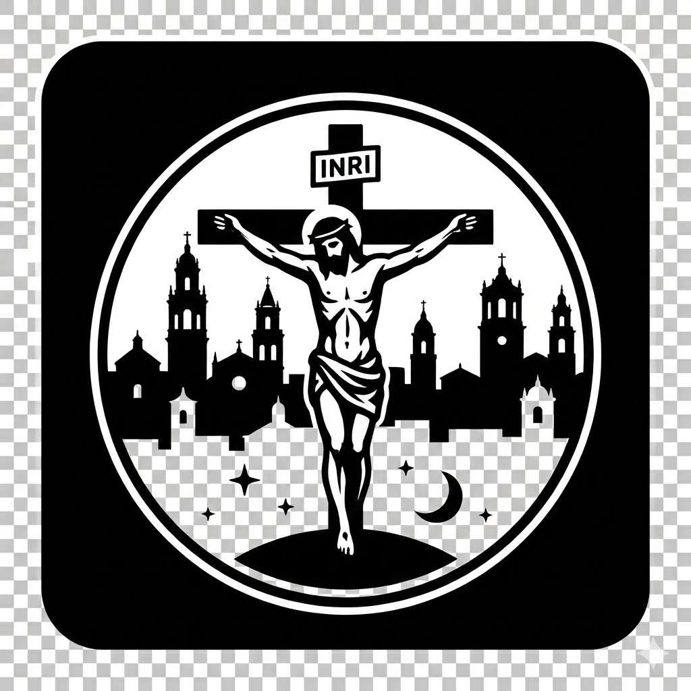

<p align="center">
  
</p>

# ✝️ Cruz de Guía Écija

**Cruz de Guía Écija** es una plataforma integral (Web y Mobile) diseñada para ofrecer toda la información relevante de la Semana Santa de Écija. Desde itinerarios detallados hasta alertas en tiempo real sobre incidencias y cambios de última hora.

---

## 📱 Plataformas

- **Web App**: Aplicación responsive de alto rendimiento construida con React y Vite.
- **Mobile App (Android/iOS)**: Aplicación nativa desarrollada con Expo y React Native, optimizada para ofrecer la mejor experiencia en dispositivos móviles.

---

## ✨ Características Principales

- **📍 Itinerarios en Tiempo Real**: Consulta el recorrido detallado de cada hermandad, incluyendo calles y horarios actualizados para el año 2025.
- **🔔 Sistema de Alertas (Push)**: Notificaciones automáticas ante incidencias graves, cambios de recorrido o información de última hora (integrado vía Telegram Bot + n8n + Expo Push API).
- **⭐ Favoritos**: Personaliza tu experiencia guardando tus hermandades preferidas para un acceso rápido.
- **🛡️ Datos Canónicos**: Información precisa obtenida de fuentes oficiales y procesada mediante herramientas personalizadas.

---

## 🛠️ Stack Tecnológico

### **Frontend Web**
- **React 18** + **TypeScript**
- **Vite** (Build tool)
- **Bootstrap 5** (Diseño responsive)
- **React Router Dom** (Navegación)

### **Mobile (Native)**
- **Expo SDK 54**
- **React Native**
- **Reanimated & Gesture Handler** (Animaciones fluidas)
- **Expo Notifications** (Alertas push)

### **Backend & Infraestructura**
- **Supabase**: Base de datos PostgreSQL para almacenamiento de Push Tokens y sincronización de datos.
- **n8n**: Motor de automatización para la gestión de incidencias.
- **Telegram Bot API**: Interfaz de administración para moderadores.

---

## 📂 Estructura del Proyecto

```text
├── root/                       # Web App (Vite)
│   ├── src/                    # Código fuente Web
│   ├── public/                 # Assets estáticos y datos generados
│   └── tools/                  # Scripts de scraping y procesamiento de datos
└── SemanaSantaEcijaAppNative/  # Mobile App (Expo)
    ├── src/                    # Código fuente Nativo
    └── assets/                 # Iconos, imágenes y fuentes
```

---

## 🚀 Instalación y Desarrollo Local

### **Requisitos Previos**
- [Node.js](https://nodejs.org/) (v18 o superior)
- [Expo Go](https://expo.dev/expo-go) (para probar en el móvil en tiempo real)

### **Ejecutar Versión Web**
1. Instala dependencias:
   ```bash
   npm install
   ```
2. Inicia el servidor de desarrollo:
   ```bash
   npm run dev
   ```

### **Ejecutar Versión Mobile**
1. Ve al directorio nativo:
   ```bash
   cd SemanaSantaEcijaAppNative
   ```
2. Instala dependencias:
   ```bash
   npm install
   ```
3. Inicia Expo:
   ```bash
   npx expo start
   ```

---

## 🛠️ Herramientas de Datos

El proyecto incluye una suite de herramientas en `/tools` para mantener la información actualizada:
- `build-hermandades-2025.mjs`: Generador principal de datos para ambas plataformas.
- `generate-supabase-sql.mjs`: Utilidad para sincronizar la base de datos distribuida.

---

## 🔒 Seguridad

Los archivos de configuración sensible como `.env`, `google-services.json` e `id_key` están excluidos del repositorio público por seguridad. Si necesitas una base para el desarrollo, consulta con el administrador del proyecto.

---

## � Licencia

Este proyecto es privado. Para cualquier uso público del código o los assets, por favor contacta con el autor.

Developed with ❤️ by **Jesusdm92**
